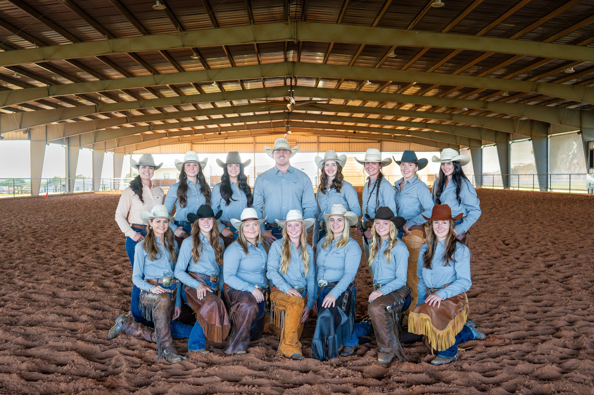

The Ranch Horse Team is a club organization that provides students with a platform to compete at the collegiate level in a variety of ranch events, ranging from the ranch riding and trail to the boxing and fence work. The team attends two major national-level contests in Abilene and Amarillo, Texas. Additionally, the team will attend other shows and host a variety of clinics throughout the year.

