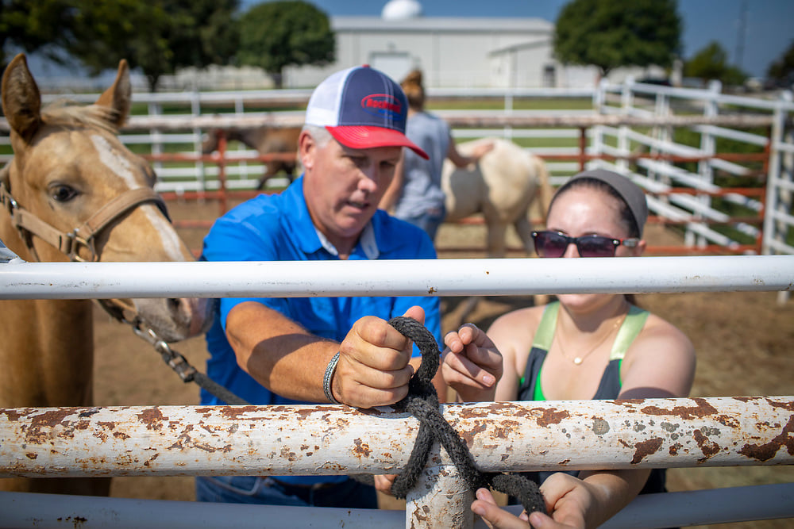

The equine program offers a variety of classes. Lecture-based courses include Equine Enterprise and Horse Science. Training courses include Training Methods, Behavior and Handling, and Sales Prep. Each of these hands-on training classes is designed to emphasize a different aspect of the training process, with young horses giving both students and horses a dynamic and well-rounded foundation. The program's home-bred weanlings and yearlings are used in these courses. Additionally, a Breeding and Foaling course is offered in the spring to allow students the opportunity to get involved with and learn about the reproductive process. All of these classes are integrated into the Equine Certificate, which is available to those students wishing to pursue a specialization in equine studies.

