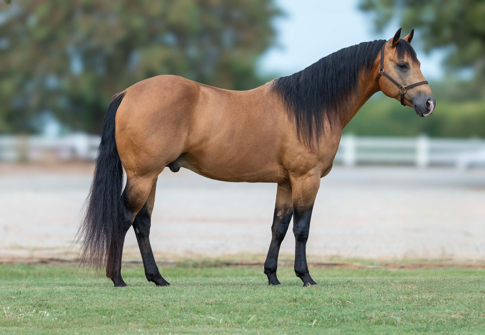
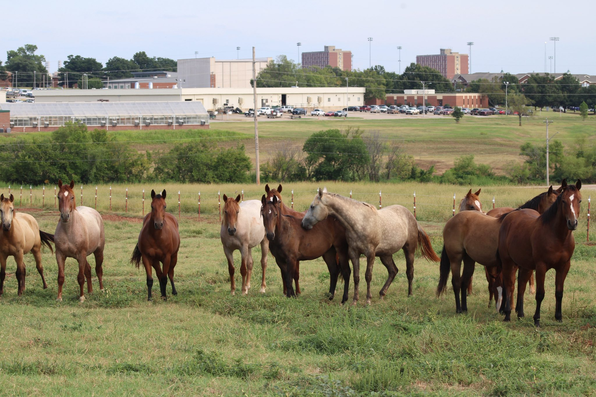

The Charles and Linda Cline Teaching Center is home to a quarter horse breeding herd. The herd consists of over 20 mares and two stallions. Mares are bred annually to a variety of publicly standing stallions, as well as OSU Shiney Nickle, a 2020 homegrown stallion. Foal crops are cared for and trained through the fall of the yearling year, when they are sold through a public online auction platform. Bloodlines of this program are focused around the roping, ranching, and cowhorse disciplines, with careful emphasis placed on the conformation, longevity, and dispositions of the horses being raised.

Pictured above is OSU Shiney Nickle. He is a 2020 AQHA buckskin stallion who stands at the OSU Vet Med Ranch. He is a son of Shiney Outlaw and out of a daughter of Sixes Pick.

